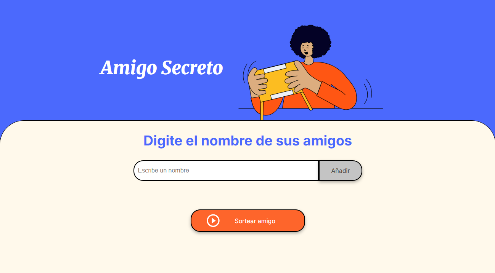

<h1>Amigo secreto </h1>

Primer Challenge  del programa ONE - Alura LATAM

<h3>Descripción del challenge</h3>

El desafió consistia en el desarrollo de una aplicación que permita a los usuarios ingresar nombres de amigos en una lista para luego realizar un sorteo aleatorio y determinar quién es el "amigo secreto".

El usuario deberá agregar nombres mediante un campo de texto y un botón "Adicionar". Los nombres ingresados se mostrarán en una lista visible en la página y al finalizar, un botón "Sortear amigo" seleccionará uno de los nombres de forma aleatoria, mostrando el reultado en pantalla.

